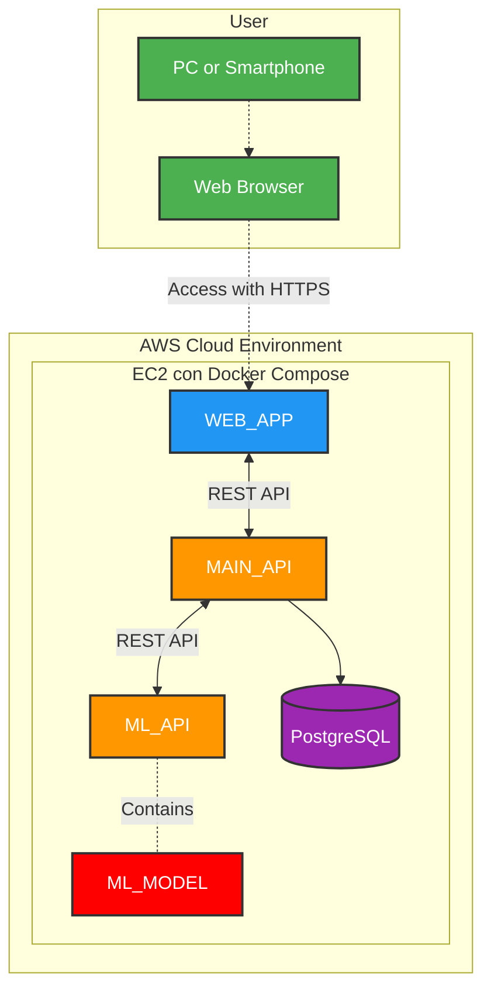

# SMPIA Project

**SMPIA** stands for "Sistema de Mantenimiento Predictivo con Inteligencia Artificial". This project is based on microservices architecture and focuses on reading vibration data from motors, analyzing it, and classifying the type of fault using a machine learning neural network.

## Subprojects

| Service Name                                                    | Description                                                                                         | Technologies Used |
| --------------------------------------------------------------- | --------------------------------------------------------------------------------------------------- | ----------------- |
| [SMPIA_WEB_APP](https://github.com/RainBoard01/SMPIA_WEB_APP)   | Client-side application built with React, serving as the frontend interface for user interactions   | React, TypeScript |
| [SMPIA_MAIN_API](https://github.com/RainBoard01/SMPIA_MAIN_API) | Main API built with Strapi, responsible for authentication and storing measurements in the database | Strapi, Node.js   |
| [SMPIA_ML_API](https://github.com/RainBoard01/SMPIA_ML_API)     | A FastAPI-based service that provides endpoints for interacting with the machine learning model     | FastAPI, Python   |
| [SMPIA_ML_MODEL](https://github.com/RainBoard01/SMPIA_ML_MODEL) | A Python project that includes the machine learning model for analyzing motor vibration data        | TensorFlow, Keras |

## Architecture



## Requirements

-  Docker
-  Docker Compose

## Installation

1. Clone the repository along with the submodules:

   ```bash
   git clone --recurse-submodules https://github.com/your-username/SMPIA.git
   ```

2. Navigate to the project directory:

   ```bash
   cd SMPIA
   ```

## Usage

1. Build and start the containers with `docker-compose`:

   ```bash
   docker-compose up --build
   ```

2. Access the services provided by the submodules through the ports specified in the `docker-compose.yml` file.

## Contribution

1. Fork the repository.
2. Create a new branch (`git checkout -b feature/new-feature`).
3. Make your changes and commit them (`git commit -am 'Add new feature'`).
4. Push your changes (`git push origin feature/new-feature`).
5. Open a Pull Request.

## License

This project is licensed under the MIT License. See the `LICENSE` file for more details.

<!-- ## Contact

For any inquiries, you can contact [your-email@domain.com](mailto:your-email@domain.com). -->
